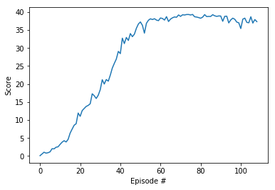

# Udacity Deep Reinforcement Learning Nanodegree
## Project 2: Navigation

#### &nbsp;

### Report
#### 1. Architecture components

*Deep Q-Networks*: Although presented and implemented in the previous project, it is important to mention Deep Q-Networks breefly once more. Many `Reinforcement Learning` arquitectures rely on these models with the main goal being to find the Action-Value function `Q(s, a)`, which represents the evaluation in the state `s` of the action `a`.

*Experience Replay:* DQN on its own is not that powerful; these types of agents tend to forget old experiences and focus on recent ones, making its structure quite unstable. Experience replay buffers solve this problem by stacking these experiences in temporal memory and replaying them into the agent.

*Actor-Critic Method*: Once understanding both policy-based and value-based methods, it is all down to realize that neither of them excludes the presence of the other inside an actor, and though they posses different approaches, it is possible to make them complement each other. That is the main focus of Actor-Critic, where the policy-based model (the actor) is in charged of learning how to act based on the state input and directly estimating the optimal policy while the value-based model (the actor) gets the job of learning to estimate the value function in order to speed up the actor's training process.

*Deep Deterministic Policy Gradient (DDPG)*: It is important to bear in mind that DQN models are not design to continuous tasks. Its implementations on these sort of tasks would require a transformation of the continuous actions into a discrete space in hopes of achiving descent enough results. One little change in the implementation of the algorithm could be to change the last activation function from softmax to a more suitable one for the action space, but this on its own is not enough to train an actor since the output space turns into an infinity of options which Deep Learning struggles with in most cases. It is in this situation that the Actor-Critic method comes handy at the task, allowing to train the agent in the continuous space without the need for discretization, since actor and critic join to guide the actor throught an stable and speeded training.

*Ornstein-Uhlenbeck process*: once inside the DDPG implementation, it does not take too long before finding out that exploration needs to be redefined as well as the model itself, and though it is not explain in great detail inside the course, the Ornstein-Uhlenbeck process comes out as a good option to disturb the action output and allow the agent to explore new scenarios.

#### 2. Hyperparameters

  | Parameter                           | Value         |
  | ----------------------------------- | ------------- |
  | Replay buffer size                  | 1e6           |
  | Batch size                          | 128           |
  | Discount Factor γ                   | 0.99          |
  | Soft Update τ                       | 1e-3          |
  | Adam learning rate α                | 1e-3          |
  | Learning steps                      | 20            |
  | Learning updates iterations         | 10            |
  | Ornstein-Uhlenbeck factor θ         | 0.15          |
  | Ornstein-Uhlenbeck factor σ         | 0.2           |
  | Exploration ε                       | 1.0           |
  | Epsilon minimum                     | 0.02          |
  | Epsilon decay                       | 2e-6          |

Moreover, the arquitecture of both the critic and the actor consisted of two linear layers of 400 and 300 units, converging to a single unit output layer representing the final action for the actor and the computed value for the critic. ReLU stands out as the activation function for the hidden layers in both models, not using any function at all for the Critic's output layer and using the Tanh function in the Actor's since the action space bounderies where -1 and 1.

#### 3. Results

The agent got to solve the environment in as little as 9 episodes, reaching its peak around the 75th iteration, almost getting to 40 points in serveral episodes.

Little it is to say about the training methods. Following the recomendations of the Udacity page, the model trained every 20 iterations inside an episode, looping over the learning algorithm 10 times. Something important to highlight is the implementation of a batch normalization layer which helps to stabilized the training phase even more. The idea come from the same [DeepMind paper](https://arxiv.org/pdf/1509.02971.pdf) presenting the DDPG architecture.

| Training Graph                           |
| ---------------------------------------- |
|   |

The weights of the actor and the critic are presented in the `actor_weights.pth` and the `critic_weights.pth` files respectively.

#### 4. Ideas for Future Work

1. Search for hyperparameters that fit better to the environment, since little was changed from the algorithm presented in class.
3. Add the rest of the extensions presented in the Rainbow paper, since Actor-Critic is only one amoung many others like `Prioritized Experience Replay` and even improve the Critic with `Double DQN` or `Dueling DQN`.
